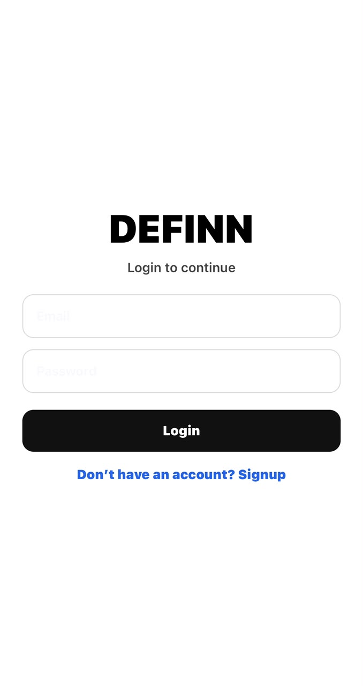
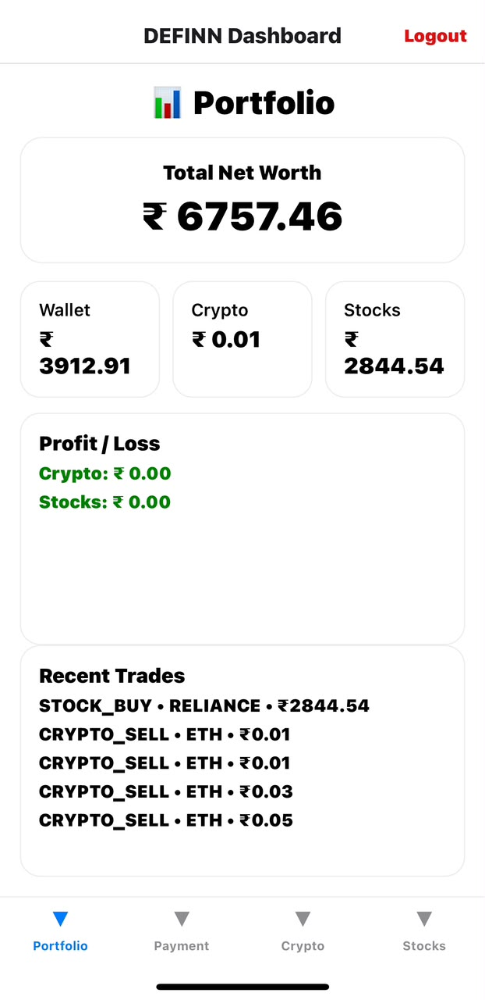
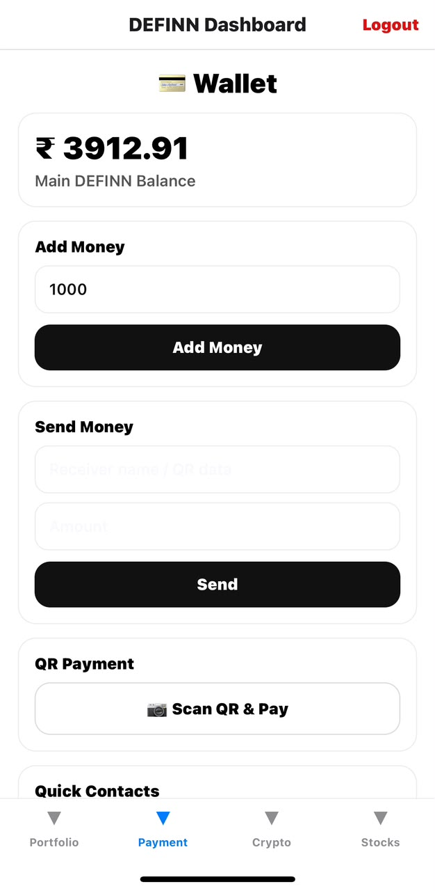
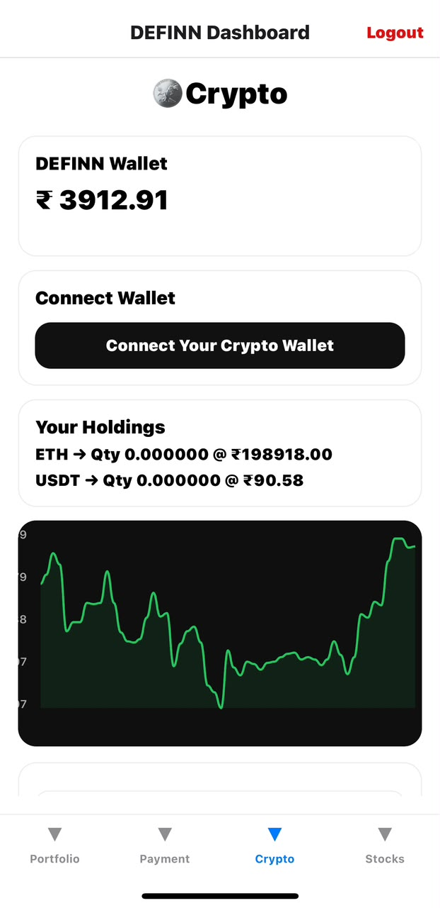
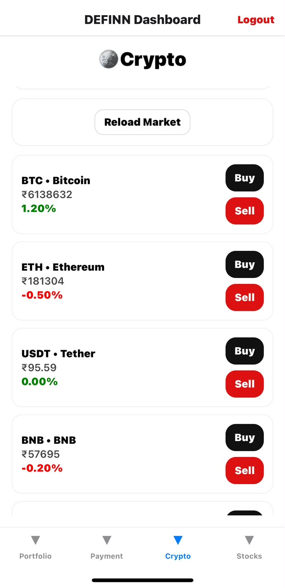
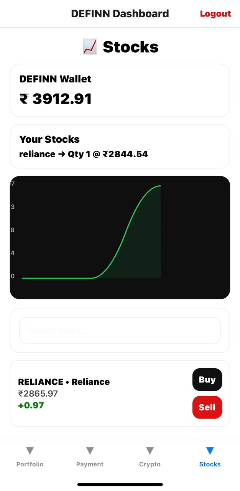
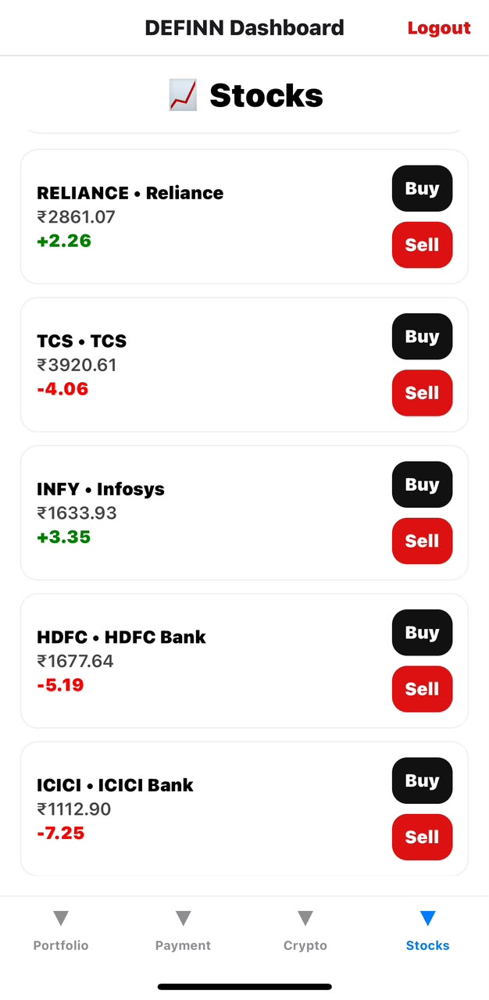

# 💰 DEFINN — Modern FinTech Trading App

<div align="center">

**A simple, modern FinTech mobile application**

*Trade stocks · Buy crypto · Manage your wallet · Track your portfolio*

[](https://developer.android.com/)
[](https://flutter.dev/)
[](https://github.com/shivangsaxena2211/DEFINN-APP)

</div>

---

## About

**DEFINN** is a modern FinTech mobile application built as a college project to simulate a real-world investment platform. It combines a polished, user-friendly interface with core financial features for managing a wallet, exploring markets, and tracking investments.

## Features

### 🔐 Authentication

- User login and registration
- Secure session management
- Logout functionality

### 📊 Portfolio dashboard

- Total net worth and wallet balance
- Stock and cryptocurrency holdings
- Profit and loss overview
- Recent transactions

### 💳 Digital wallet

- Add and send money
- QR payment interface
- Quick contacts

### 📈 Stock market

- Browse and search stocks
- Buy and sell flows
- Portfolio tracking and performance graphs
- Sample supported stocks: Reliance, TCS, Infosys, HDFC Bank, and ICICI Bank

### 🪙 Cryptocurrency

- Buy and sell crypto
- Crypto wallet and holdings overview
- Market charts and price refreshes
- Sample supported coins: Bitcoin (BTC), Ethereum (ETH), Tether (USDT), and Binance Coin (BNB)

### 📉 Analytics

- Interactive charts
- Portfolio growth and market trends
- Profit tracking

## Screenshots

Add the app screenshots to a `screenshots/` directory, then uncomment or adapt the examples below.

```text
images/
├── login.jpg
├── portfolio.jpg
├── wallet.jpg
├── crypto.jpg
├── crypto-market.jpg
├── stocks.jpg
└── stock-details.jpg
```
<p align="center">







</p>

## Tech stack

| Area | Technology |
| --- | --- |
| Frontend | Flutter, Dart |
| Backend & database | Firebase Authentication, Cloud Firestore |
| State management | Provider / Flutter state management |
| Charts | FL Chart |

## Project structure

```text
lib/
├── screens/
├── widgets/
├── services/
├── models/
├── providers/
├── utils/
├── firebase/
└── main.dart
```

## Getting started

### Prerequisites

- [Flutter SDK](https://docs.flutter.dev/get-started/install)
- An Android emulator or physical Android device
- Firebase project configuration, if using the Firebase-backed features

### Installation

```bash
git clone https://github.com/shivangsaxena2211/DEFINN-APP.git
cd DEFINN-APP
flutter pub get
flutter run
```

## Future improvements

- Real-time market APIs
- UPI and Razorpay payment integration
- AI investment suggestions
- Dark mode and watchlists
- Push notifications and price alerts
- Biometric authentication
- Financial news feed
- Multi-language support
- Transaction-history export

## Learning objectives

This project was created to explore Flutter development, Firebase integration, UI/UX design, state management, mobile app architecture, API integration, and financial application development.

## Contributing

Contributions are welcome.

1. Fork the repository.
2. Create a feature branch: `git checkout -b feature-name`
3. Commit your changes: `git commit -m "Add new feature"`
4. Push the branch: `git push origin feature-name`
5. Open a pull request.

## Developer

**Shivang Saxena**

- GitHub: [@shivangsaxena2211](https://github.com/shivangsaxena2211)
- Project: [DEFINN-APP](https://github.com/shivangsaxena2211/DEFINN-APP)

**Shivansh Tyagi**

- GitHub: [@shivansh917](https://github.com/shivansh917)
- Project: [DEFINN-APP](https://github.com/shivansh917/DEFINN-APP)

**Kanishk Gulati**

- GitHub: [@kanishkG1](https://github.com/kanishkG1)
- Project: [DEFINN-APP](https://github.com/kanishkG1/DEFINN-APP)

---

<div align="center">

**DEFINN — Smart Finance, Simplified.**

If you found this project useful, please consider giving it a star. ⭐

</div>
